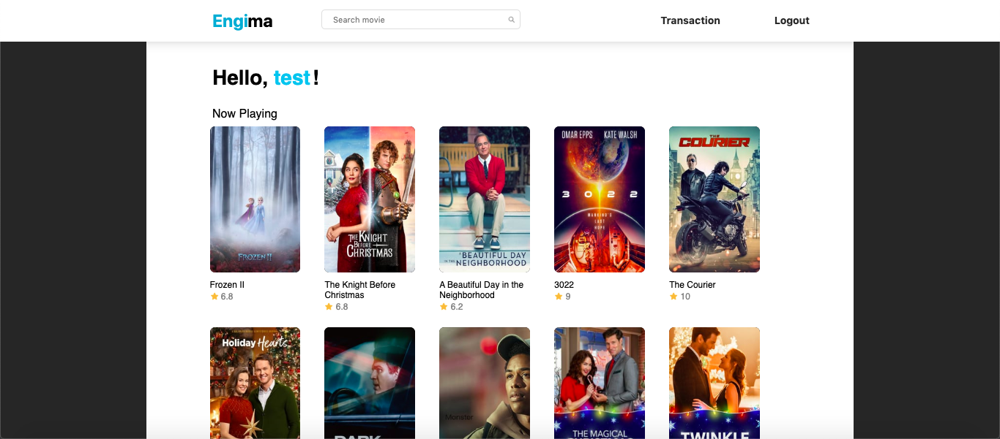
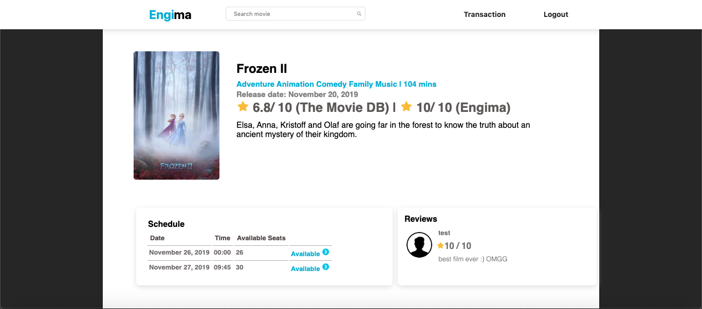

# Engima

## Deskripsi
Aplikasi web yang dibuat menggunakan html, php, css, dan javadcript ini berfungsi sebagai wadah pemesanan tiket dari Engima. Website ini memiliki beberapa fitur, yaitu pembelian tiket, memberi ulasan pada film yang telah ditonton, login dan register, riwayat pembelian tiket. 
Database film yang digunakan terintegrasi dengan API The Movie DB. Sementara itu, untuk permasalahan transaksi, aplikasi ini juga terintegrasi dengan dua web service yaitu Web Service Transaksi dan juga Web Service Bank.

## Basis Data
Terdapat beberapa perubahan basis data yang dilakukan untuk menyesuaikan spek yang telah ditentukan. Perubahan tersebut yaitu:
1. Tabel akun berubah menjadi tabel users dan isinya ditambah sebuah kolom baru bernama id_user
2. Tabel film dihapus dan data film diambil langsung dari The Movie DB
3. Tabel jadwal berubah menjadi tabel bioskop yang isinya ditambah sebuah kolom baru yaitu id_film dan kolom waktu dihapus
4. Tabel kategori dihapus dan data film diambil langsung dari The Movie DB
5. Tabel memberi dihapus
6. Tabel menonton dihapus
7. Tabel tayang dihapus
8. Tabel tempat_duduk dihapus dan ditambah tabel baru bernama booked_seats
9. Tabel termasuk dihapus
10. Tabel ulasan dihapus menjadi tabel review
11. Tabel users ditambahkan

## Perubahan Tampilan
#### Home
Film yang ditampilkan diambil dari The Movie DB dan merupakan film yang dirilis tidak lebih dari 7 hari

### Film Detail
Terdapat 2 jenis rating, yaitu rating yang berasal dari The Movie DB dan rating yang berasal dari user Engima

### Buy Ticket
Ketika pengguna membeli tiket, akan muncul id transaksi dan nomor akun virtual unik untuk pembayaran tiket

### Transaction History
Ditampilkan id dan status pembayaran

## Pembagian Tugas WBD
1. Halaman Home: 13517017
2. Halaman Film Details: 13517032
3. Halaman Buy Ticket: 13517104
4. Halaman Transaction History: 13517032
5. Halaman Search Result: 13517017

## Pembagian Tugas DPPL
1. CI/CD: 13517017